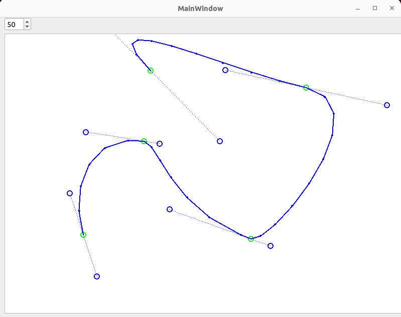
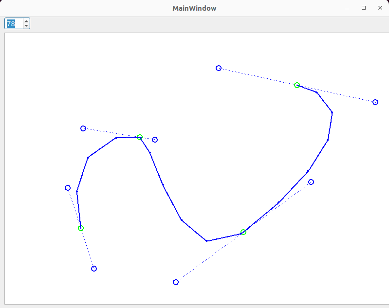
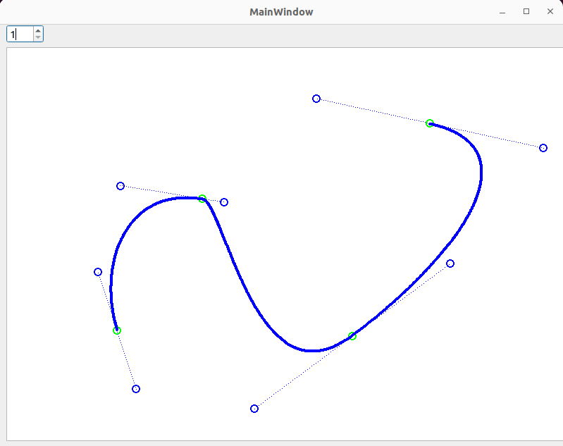

#  Qt Pen Drawer

This qt gui example lets you draw and edit bezier curves. This package differs to just a generic bezier drawing that the line is discretized by a set, average distance along the line, not by simple render resolution. The effort was to gain access to discrete points at a specified interval without needing to draw them meticulously one by one. The qt interface helps to draw complex lines with bezier control points, but converts all line points to discrete coordinates by an interval that can be set through the gui.

## Installation

This package is wrapped and installed with the `ament_cmake` build tool. Therefore:
```
mkdir -p colcon_ws/src
cd colcon_ws/src
git clone git@github.com:yschulz/q_pen_drawer.git
cd colcon_ws
colcon build
```

It can be run like any other executable, it is installed in `colcon_ws/install/lib/q_pen_drawer`

## Usage

Bezier points can be added by simply clicking inside the image and dragging the control point. A controlpoint can be "re-dragged" by clicking on it and dragging the handle. Also the bezier point origins can be shifted the same way.



By changing the value of the spin box at the top one can change the sample distance between the line points. Here is an example for a coarse setting:



And here is an example for a fine setting:

